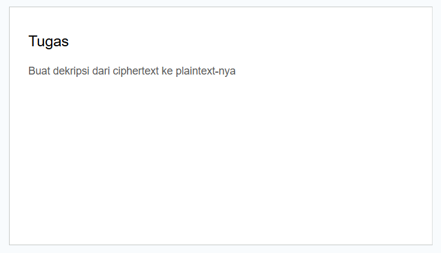
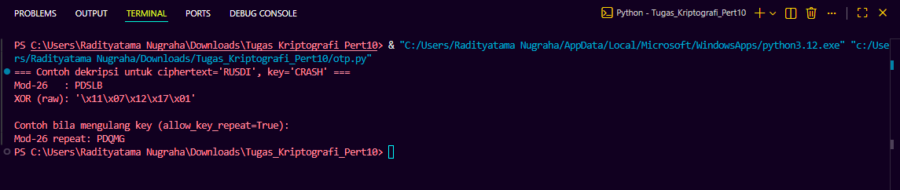
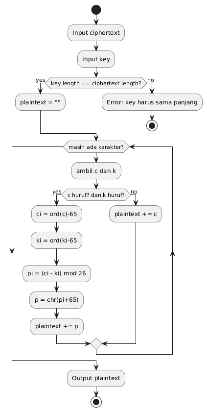

# Tugas Pertemuan 10 

|Nama|NIM|Kelas|Mata Kuliah|
|----|---|-----|------|
|**Radityatama Nugraha**|**312310644**|**TI.23.A3**|**Kriptografi**|

# Soal :



## Code Program :
```python
def mod26_decrypt(cipher, key):
    out = []
    for c, k in zip(cipher, key):
        if c.isalpha() and k.isalpha():
            ci = ord(c.upper()) - ord('A')
            ki = ord(k.upper()) - ord('A')
            pi = (ci - ki) % 26
            out.append(chr(pi + ord('A')))
        else:
            out.append(c)
    return ''.join(out)

def xor_decrypt(cipher, key):
    out = []
    for c, k in zip(cipher, key):
        out.append(chr(ord(c) ^ ord(k)))
    return ''.join(out)

def repeat_or_error(text, target_len):
    if len(text) == target_len:
        return text
    return (text * ((target_len // len(text)) + 1))[:target_len]

def decrypt(cipher, key, mode='mod26', allow_key_repeat=False):
    if len(key) < len(cipher):
        if allow_key_repeat:
            key = repeat_or_error(key, len(cipher))
        else:
            raise ValueError("Panjang key harus sama dengan ciphertext (OTP). Gunakan allow_key_repeat=True jika ingin mem-repeat key).")
    if mode == 'mod26':
        return mod26_decrypt(cipher, key)
    elif mode == 'xor':
        return xor_decrypt(cipher, key)
    else:
        raise ValueError("Mode tidak dikenal: pakai 'mod26' atau 'xor'")

ciphertext = "RUSDI"
key        = "CRASH"

print("=== Contoh dekripsi untuk ciphertext='RUSDI', key='CRASH' ===")
try:
    print("Mod-26   :", decrypt(ciphertext, key, mode='mod26'))
except Exception as e:
    print("Mod-26   : ERROR -", e)

try:
    print("XOR (raw):", repr(decrypt(ciphertext, key, mode='xor')))
except Exception as e:
    print("XOR      : ERROR -", e)

short_key = "CR"  
print("\nContoh bila mengulang key (allow_key_repeat=True):")
print("Mod-26 repeat:", decrypt(ciphertext, short_key, mode='mod26', allow_key_repeat=True))
```

## Output :



## Flowchart OTP :



